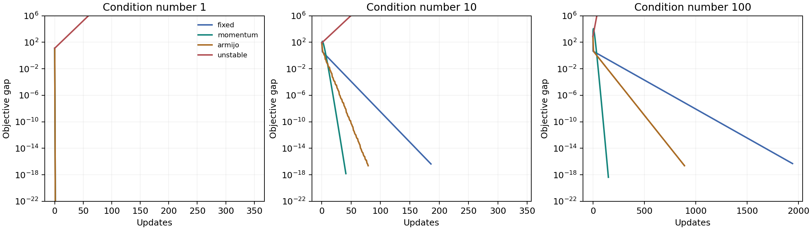

# Gradient Descent: When Step Size and Conditioning Matter

A reproducible optimization lab comparing fixed-step gradient descent,
spectrally tuned heavy-ball momentum, Armijo backtracking, and an intentionally
unstable step on the **same objectives, starting points, and stopping rule**.



## Run the experiment

Python 3.9–3.12, CPU only. No data, accounts, or notebook server needed:

```bash
git clone https://github.com/takakhoo/gradient-descent-lab.git
cd gradient-descent-lab
python -m venv .venv
source .venv/bin/activate  # Windows: .venv\Scripts\activate
python -m pip install -r requirements-reproduce.txt
python -m unittest -v
python experiments.py --seed 7 --output results
```

This regenerates the plot, [summary CSV](results/summary.csv), and
[complete numerical traces](results/metrics.json). CI runs the same experiment
and uploads its outputs without silently replacing the checked-in results.

## Measured results

Updates to reach gradient norm ≤ `1e-8`, with a 2,000-update budget:

| Condition number | Fixed step | Heavy-ball | Armijo |
|---|---:|---:|---:|
| 1 | 1 | 1 | 1 |
| 10 | 186 | 41 | 79 |
| 100 | 1,943 | 150 | 891 |

At condition number 100, tuned momentum required about **13× fewer updates**
than fixed-step descent in this experiment. That is not a wall-clock speedup
or a claim about arbitrary objectives. Backtracking also performs extra
objective evaluations; those counts are included in the CSV and traces.

The unstable step diverges for all three problems and is explicitly labeled
`diverged`, never mistaken for convergence. Plots cap the vertical display at
`1e6`; complete divergent traces remain in JSON.

## Why this comparison is interpretable

- Objective: `f(x) = xᵀAx / 2`, with known optimum `x = 0`, `f = 0`.
- The seeded rotation is shared across conditions; eigenvalues are `(1, κ)`.
- Every method starts at `(4, -3)` and uses the same gradient-norm tolerance.
- Fixed step is `1/L`; the unstable control is `2.1/L`.
- Heavy-ball uses quadratic-specific parameters `4/(√L+√μ)²` and
  `((√L-√μ)/(√L+√μ))²`. It has access to curvature information, so this is
  **not** a blind hyperparameter competition.
- Armijo starts each search at step 1 and halves it until sufficient decrease.
- Budget exhaustion, divergence, and line-search failure are separate outcomes.
- `metrics.json` records the seed, Python/NumPy versions, settings, and iterates.

Seven regression tests check an exact closed-form trajectory, one-step
convergence, Armijo monotonicity, deterministic reruns, invalid inputs,
divergence, and budget handling.

## Original notebook

[Gradient Descent Exp.ipynb](Gradient%20Descent%20Exp.ipynb) retains the original
autograd derivations and one-dimensional examples. To explore it:

```bash
python -m pip install -r requirements.txt
jupyter lab "Gradient Descent Exp.ipynb"
```

The notebook no longer runs Conda inside a cell. Its `x^(3/2)` example now uses
**projected** gradient descent on `x ≥ 0`; the old unconstrained update crossed
the domain boundary and generated invalid values. The absolute-value example
uses `abs(x)` directly, with autograd's zero subgradient at the kink. The notebook
was re-executed after these fixes. These constrained/non-smooth examples are
distinct from the smooth quadratic comparison above.

## Scope

Educational experiments, not a production solver or a general optimizer
benchmark. Different BLAS/platform versions can change final digits or a
stopping iteration near tolerance. Numerical behavior is tested with
tolerances, not byte-identical plot hashes.

References: [NumPy symmetric eigensolver](https://numpy.org/doc/stable/reference/generated/numpy.linalg.eigh.html)
and [GitHub's Python CI guidance](https://docs.github.com/en/actions/tutorials/build-and-test-code/python).
